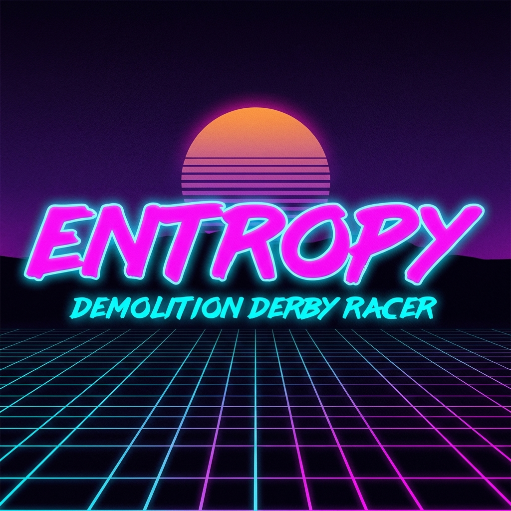

# Entropy Orchestration 🏎️

> [!WARNING]
> **This is an entirely "vibe coded" project** developed using **Antigravity** and **GitHub Copilot**. 
> It was created as an experiment to explore the strengths and weaknesses of various large language models (LLMs) during the **2026 Global Game Jam**. 
> Expect the unexpected!

A **48-hour Game Jam** demolition derby racing game with a synthwave aesthetic.



## 🎮 Concept

Players use their **phones as controllers** to drive neon cars on a shared big screen. Last car standing wins!

**Theme:** "MASK" - Players wear digital masks that hide their identity until elimination.

## 📋 Features

- 🚗 **12 Unique Tracks** with themes (Stadium, Industrial, Volcanic, etc.)
- 🎵 **Dynamic Music** with 12 track-specific styles (90-160 BPM)
- 🔫 **Weapons System** - Missiles (40 dmg) and Lasers (20 dmg)
- 🤖 **AI Opponents** - 1-3 CPU cars spawn when <3 players
- 🎭 **5 Mask Types** - Classic, Oni (+15% resist), Tech (+50% boost regen), Clown (bursts), Skull (+10% speed)
- 🏆 **Leaderboard** - Wins, kills, deaths, games played tracking
- 📺 **Demo Mode** - Auto-starts after 60s with no players (4-6 CPU battle)
- 🛡️ **Powerups** - Repair, Boost, Shield, Ghost, Juggernaut, Weapon, 67Meme
- 💥 **Combat** - Directional ramming with damage modifiers
- 🏎️ **Race Mode** - 3 laps to win with waypoint-based pathfinding

## 🏗️ Architecture

```
Entropy-Orchestration/
├── server/          # Node.js + Socket.io + cannon-es physics
├── renderer/        # React Three Fiber (R3F) + Drei visuals
└── controller/      # Mobile-optimized React UI
```

## 🚀 Quick Start

```bash
# Install dependencies
npm install

# Start all services
npm run dev:server      # Server on :3000
npm run dev:renderer    # Renderer on :5173
npm run dev:controller  # Controller on :5174
```

## 📱 How to Play

1. Open the **renderer** on a big screen/TV
2. Scan the QR code with your phone
3. Enter your name and choose a mask
4. Use phone tilt to steer, touch to accelerate/brake
5. Pick up powerups, fire weapons, survive!

## 🧪 Testing

```bash
cd server
npm test
```

Comprehensive test suite covering: Physics, Boundaries, Leaderboard, Demo Mode, Tracks, Weapons, Damage, Masks, Audio, CPU Pathfinding, Game Flow, Camera, Powerups, Spawn Safety.

## 🎨 Tech Stack

| Component | Technology |
|-----------|------------|
| Server | Node.js, Socket.io, cannon-es |
| Renderer | React, Three.js, R3F, Drei |
| Controller | React, DeviceOrientation API |
| Audio | Web Audio API (procedural synth) |
| Testing | Jest |

## 📡 Socket Events

### Server → Client
- `worldState` - Game world state (players, powerups, traps)
- `gameState` - Game phase (LOBBY, COUNTDOWN, RACING, WINNER)
- `trackData` - Current track info
- `leaderboard` - Top 10 players
- `projectileFired` - Weapon projectile spawned

### Client → Server
- `join` - Join with name and mask type
- `input` - Steering, throttle, boost
- `fire` - Fire weapon

## 🎭 Mask Theme

The "mask" game jam theme is interpreted as digital identity:
- Players are "MASKED RACER #N" until death reveals true name
- 5 visual mask styles for car customization
- Future: Mask powerup to steal another player's appearance

---
Made with 💜 for Global Game Jam 2026
